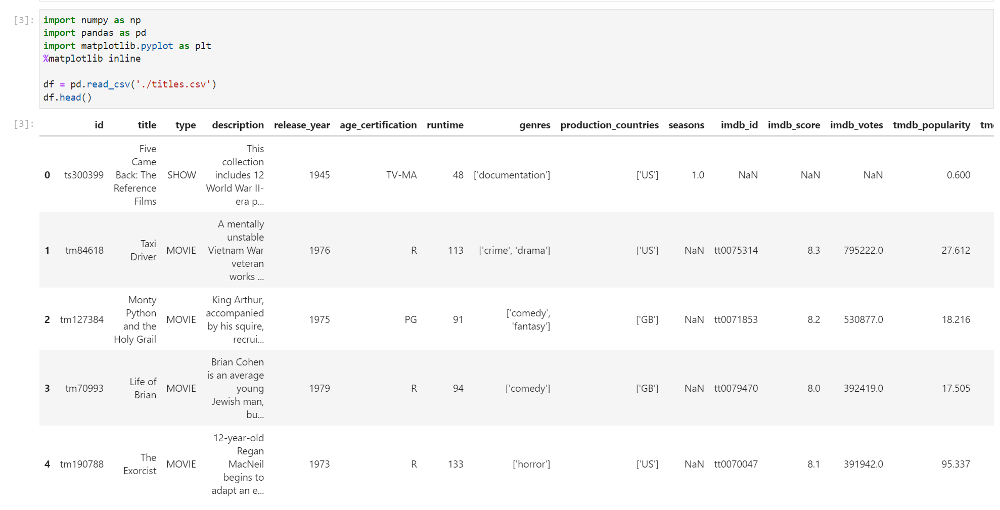
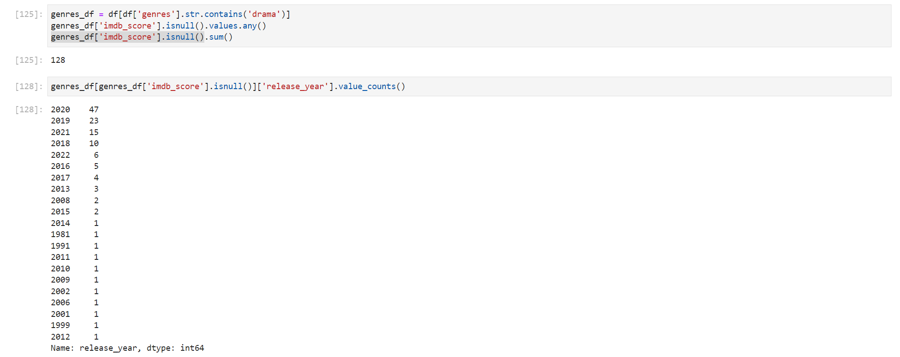

# Netflix TV Shows and Movies (May 2022) Data Analysis

The dataset selected in this project is collected from [Netflix TV Shows and Movies](https://www.kaggle.com/datasets/victorsoeiro/netflix-tv-shows-and-movies). This data set was created to list all shows available on Netflix streaming, and analyze the data to find interesting facts. This data was acquired in May 2022 containing data available in the United States.

In order to understand and define bussiness questions for our dataset, we should explore some of its characteristics. First we need to load our csv files. This dataset contain 2 csv files for Movie Title and Actor/Director data from these movies. For further exploration we can use both these files to make a recommendation system base on the link between Movies and Actors but for now, let's just analyze the Move Title only.

Let's see how many columns and rows do we have here

For our titles.csv, we have total 5806 rows (including headers and unique movie's titles) Each has its own characteristics, some is unique value such as id, title, description, imdb_id, tmdb_id. These values help us determine which object we are dealing with. Others are for classifying which type does this movie belong to (genres), when dit it released (release_year), is it a movie or a tv show (type),... Our dataset has 15 columns of movie information, these columns are crucial in definining bussiness questions.

Time to see inside our dataset

We have some columns with object type (String, Array). For categorial columns like **type** with String, personal I would like to transform them to some primitive type other than *String* but just leave them alone and comeback when we need them. Another categorial columns we should take care of is **genres** when it's datatype *Array* is not supported by pandas. We can transform it to string concat with a comma or just leave it and perform in-code transformation.

Let's check if these is any empty value in here

Theoretically, 25 to 30% of missing value can be allowed, above this threshold we should consider the impact of these columns to our bussiness. In this case, **seasons** can only applied on titles with type is SHOW. For **age_certification** is allowed in this case because not all producers tag their movies with this, we can assume these movies can be watched by everyone. Normally we can drop empty values from our dataset but this may cause loss of information and can produce biased result. We'll comeback later in IMDB Score and choose how to deal with this.

## Question 1:
*Which genres have the most movies?*

Here we encounter an situation where our genres field are array of string. Each movie can contain multiple genres like fantasy, scific, horror. Each type in a movie count as one. So our job is to find, seperate this value and count all these values.

After deduplicating we have a list of genres has been cleaned (remove empty, strip, deduplicate). With this list, it's time to run count on our dataset.

Through this plot, **drama** and **comedy** is very popular among others while **reality** is quite up side down. Combining 2 most popular factors can bring success for the movie but in the other hand so many movies in this category may become their rivals and reduce quality of the movie.

## Question 2:
*What is the best age-certification tag for drama movies?*

Age Certification is a move rating system created for classifying the audience it is targeting to, Netflix use this system to notify viewer about what they are going to view and make decision before continue. More info about Age Certification: [Movie Ratings](https://gopioneer.com/wp-content/uploads/2017/01/dtv_movieratings.pdf)

Most of drama movies are Strongly Cautioned due to contains material that may not suitable for children under 14 years of age. That mean target audience of this cateogry is mostly adults and teenagers. Maybe making a drama for childen is not a good ideal tho 

## Question 3:
*How many movies has drama factor released every year? And does their quality increase overtime?*

For counting by every year, we can use groupby and count function by index (or in this case is **id**) to get total released movies every year.

As we can see, from 1950 to nearly 2015, movies with drama factor is not top priority of producers until after 2015. On the next 5 years, more than 400 movies had been released but then fell to 100 movies per years. With so much choices in a single time range, let's check their quality base on viewer vote score on IMDB site.

For IMDB Score, we run in to trouble here. Some records has NaN values in IMDB Score. This because of these movie were release too long in the past or error while collecting datas. Now, we have several options here: set value to 0.0, deleting rows (128 rows), imputation using mean of IMDB Score that year. With only 4.4% of NaN value in total more than 2901 movies, it's safe to delete these rows contain NaN. 

Let's see what info can new data give us

A trending in here while total number of movies released in over past 3 year increase but did not get good reviews (low IMDB Score) from audience. Perhaps *quality over quantity* should be a good choice for producers and Netflix.
